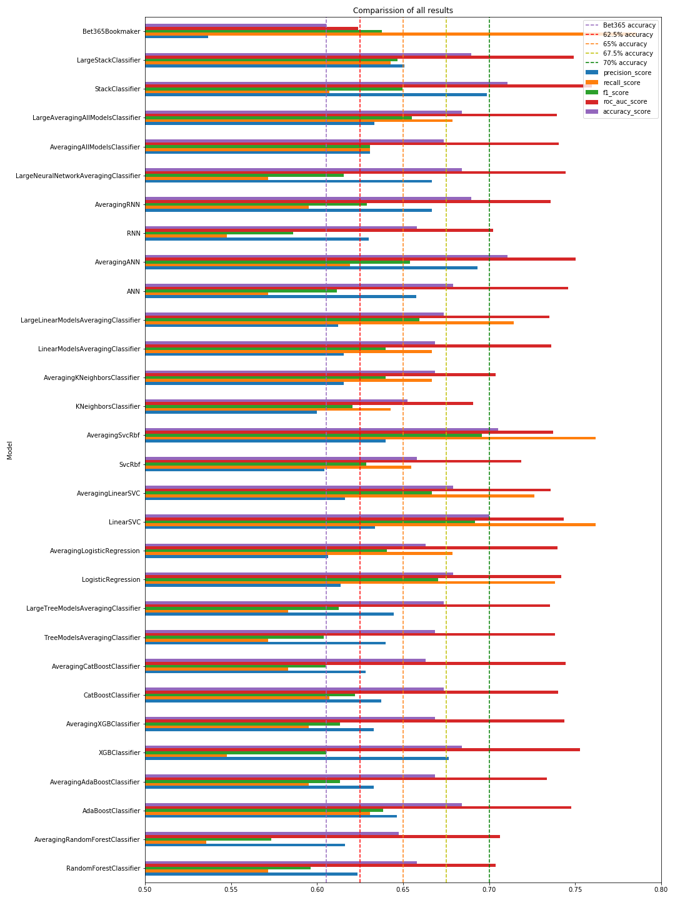

# Premier_League_Predicting_Winning_Teams_2019-2020
This project is finishing project for 6 months Sages [Kodołamacz Data Science Bootcamp](https://www.kodolamacz.pl/bootcamp-datascience/), which I was participating since September 2019.

## Overview
This machine learning project is to predict winning teams in the Premier League in the 2019-2020 season based on historical statistics since the 2000-2001 season.

## Goals
The goal is to achieve better forecasting accuracy than BET365 Bookmacher <b> 60.05% </b>.

## Data
All data sets come from [http://football-data.co.uk/data.php](http://football-data.co.uk/data.php)
More info about data in attached file <i>Notes about data.txt</i>

## Dependencies
* Python 3.7
* Pandas
* Numpy
* Matplotlib
* Scikit-learn
* Scipy
* Xgboost
* CatBoost
* TensorFlow 2.0 GPU Version

## Action plan
After data cleaning and features engineering build a several ensembling models using the best simple classifiers of each type.

## Scope of work
* 1 Data preprocessing - stage 1
* 2 Data preprocessing - stage 2
* 3 Data preprocessing - data spliting
* 4 Data preprocessing - features selection
* 5 Modeling - selection of the best tree-based models
* 6 Modeling - selection of the best linear models
* 7 Modeling - selection of the best deep learning models
* 8 Modeling - advance ensebling
* 9 Final comparission

## Final results

The best machine learning models achieved just over 71% accuracy: StackClassifier and averaging version of Neural Network (AveragingANN)